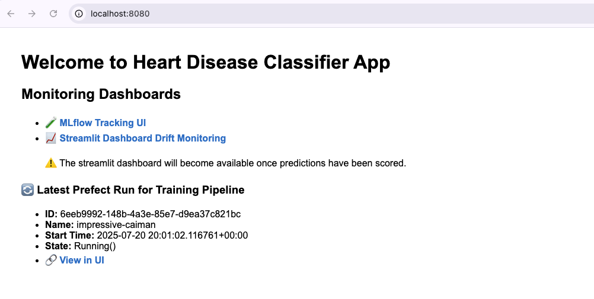

# MLOPS ZoomCamp Capstone Project

## Objective

The goal of this project is to develop and build a MLOps pipeline to build and deploy a predictive model to determine the presence or absence of coronary artery disease (CAD)

## Dataset

The dataset used in this project was downloaded from [Kaggle](https://www.kaggle.com/datasets/iamtanmayshukla/cardiac-arrest-dataset/data). It comprises five widely used heart disease datasets available indepedently on the [UCI Machine Learning Repository](https://archive.ics.uci.edu/).

- Total Instances: 1026 patients

- Number of Features: 14 clinical and diagnostic attributes (Please refer to Kaggle for details).

- Target Variable: Presence or absence of coronary artery disease (CAD)


## Clone the Project

```
https://github.com/ju-arroyom/mlops-zoomcamp-project-2025.git

```

## Local Poetry Setup (Python >= 3.10)

After cloning the project, it is suggested to install `poetry` to be able to run the script that scores predictions.

Please run the following command on your machine:

```
make setup_poetry_local
```

This command will first check for a poetry installation, if you don't have one it will install poetry via pipx.


## Run from Container

After cloning the repo, please run the following command:

```
make build_app_image

make build_mlserver_image

make up_build
```

This commands will build the image for the app `build_app_image` and the image for the mlflow server `build_mlserver_image`.

The `up_build` command will run docker-compose to connect the different elements required for:

- Training pipeline  (mlflow + prefect server)

- Monitoring (Evidently + PostgreSQL + Streamlit)

- Allow visibility of all of these components in FastAPI

**Note** docker-compose is not run on detached mode with this make command, you will see the logs.

After seeing this message on your terminal `trainer-1 exited with code 0`, please run

```

make score_predictions

```

This command will call `src/mlops/inference/predict.py` to score the predictions in the test set. The terminal will output the predicted label for each one of the observations and prediction drift metrics will be available in the streamlit dashboard in the link provided in FASTAPI [http://localhost:8080/](http://localhost:8080/).

<p align="center" width="100%">
  
</p>


Once you scored the predictions and inspected the different links please remember to run:

```
make down_build
```

This will stop and remove all the containers that were created as well as networks and volumes.

# Want to run test locally?

```
make run_unit_tests

make integration_test
```


## Currently Supported

 - [x] Orchestration with Docker Compose
 - [x] Experiment tracking + Model Registry
 - [x] Unit tests
 - [x] Linter and code formatter (make quality_checks)
 - [x] Makefile to automate different tasks
 - [x] Pre-commit hooks for code formatting and running tests
 - [x] CI Pipeline (Github Actions) for unit and integration tests
